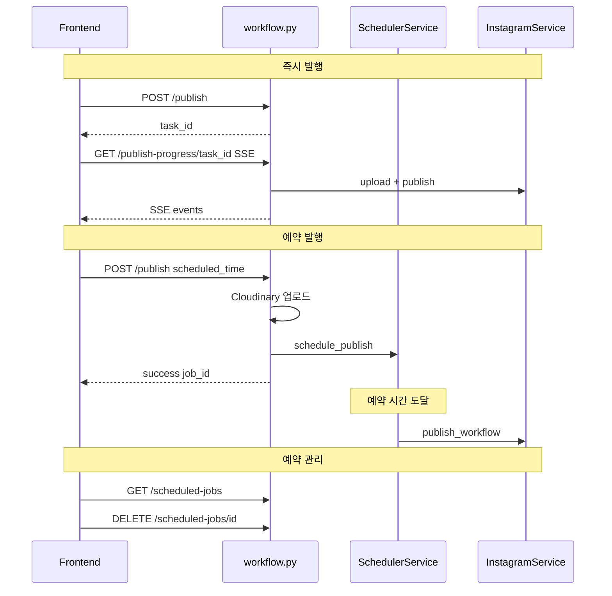

# 미진행 사항: 예약발행 + 발행 진행상태 (C1~C6)

> **참고:** C7(에러 메시지 개선), C8(백엔드 검증), C9(예약 실패 시 즉시 발행 대체)는 이미 완료됨.  
> 아래 6개 항목만 별도 진행하면 됨.

---

## C1. APScheduler 기반 scheduler_service.py 생성

**새 파일:** `app/services/scheduler_service.py`

- `schedule_publish()`, `cancel_scheduled()`, `reschedule()`, `get_scheduled_jobs()`, `get_job_status()` 구현
- 메모리 딕셔너리 저장 (향후 JSON/DB 영속화 가능)

**의존성:** `requirements.txt`에 `apscheduler>=3.10.0` 추가

---

## C2. publish() 엔드포인트 리팩토링

**대상:** `app/api/workflow.py`

- `scheduled_publish_time`이 있을 때: Instagram API에 전달하지 않고 **자체 스케줄러(C1)**에 등록
- 이미지를 미리 Cloudinary 업로드 후 URL 저장

**대상:** `app/services/instagram_service.py`

- `publish_workflow()`, `create_carousel_container()`, `create_single_image_container()`에서 `scheduled_publish_time` 파라미터 및 관련 코드 제거

---

## C3. SSE 기반 발행 진행 스트리밍

**새 엔드포인트:** `GET /api/workflow/publish-progress/{task_id}`

- `StreamingResponse` + `asyncio.Queue`
- 단계별 이벤트: `upload` → `container` → `carousel` → `polling` → `publish` → `done`

**연계:** `publish()` 응답에 `task_id` 추가, 프론트엔드에서 `EventSource` 구독

---

## C4. 예약 관리 API

- `GET /api/workflow/scheduled-jobs` — 예약 목록
- `DELETE /api/workflow/scheduled-jobs/{job_id}` — 예약 취소
- `PUT /api/workflow/scheduled-jobs/{job_id}` — 시간 변경

---

## C5. 예약 목록/취소/변경 UI

**대상:** `app/templates/index.html`

- 예약 발행 영역 아래에 "예약 목록" 섹션 추가
- `loadScheduledJobs()`, `cancelScheduledJob()`, `rescheduleJob()` 함수 구현

---

## C6. 발행 진행 모달 UI

**대상:** `app/templates/index.html`

- `publishToInstagram()`, `schedulePublish()` 수정
- `EventSource`로 SSE 연결, 진행 모달 표시 (단계별 메시지 + 진행률)

---

## 권장 진행 순서

1. **C1** — 스케줄러 서비스 생성 (나머지의 기반)
2. **C2** — publish()가 예약 시 스케줄러 사용하도록 변경
3. **C4** — 예약 관리 API (C5 UI가 호출)
4. **C5** — 예약 목록/취소/변경 UI
5. **C3** — SSE 진행 스트리밍
6. **C6** — 발행 진행 모달 UI

---

## 데이터 흐름도 (목표)

---

*원본 플랜: `최종_통합_대기_플랜_3707dafc.plan.md` (카테고리 C)*
